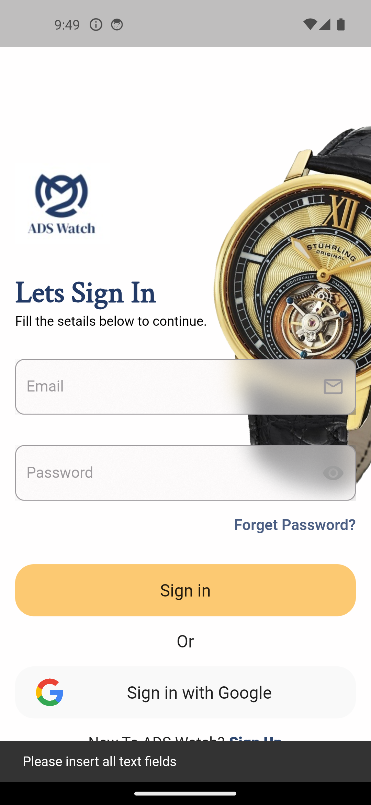
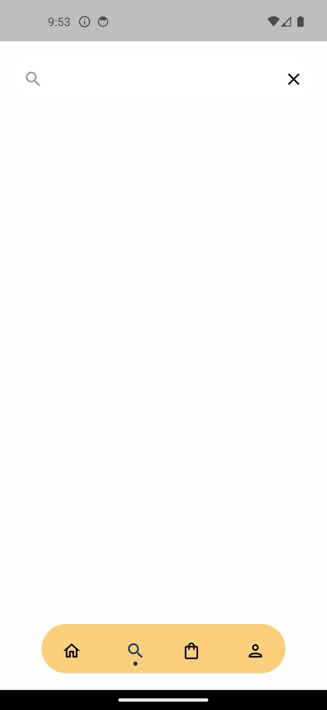

# Watch Store App

This is a Flutter mobile application for a Watch Store. The app allows users to browse and purchase watches, manage their cart, and update their profile information.

## Libraries Used
- glass 1.0.2+1
- dot_navigation_bar 1.0.2
-  flutter_carousel_widget: ^2.1.2
## Screens

### Splash Screen
The splash screen is displayed when the app is launched and provides a visual transition before entering the main app.

### LogIn
The login screen allows users to authenticate themselves using their credentials.
 
### SignUp
The signup screen enables new users to create an account by providing their details.

### HomeScreen
The home screen is the main screen of the app, where users can browse and explore different watches.

### Product Details
The product details screen displays detailed information about a specific watch, including its images, description, and price.

### Cart Screen
The cart screen shows the items added to the user's cart. Users can apply a coupon by entering "Flutter" in the designated field.

### Profile Screen
The profile screen displays the user's profile information, such as name, email address,mobile number, and password. Users can update their information on this screen.

### Checkout Screen
The checkout screen allows users to review their selected items, enter shipping information, and proceed with the purchase.

### Filter Screen
The filter screen provides options for users to filter watches based on specific criteria.

### Search Screen
The search screen allows users to search for watches.
